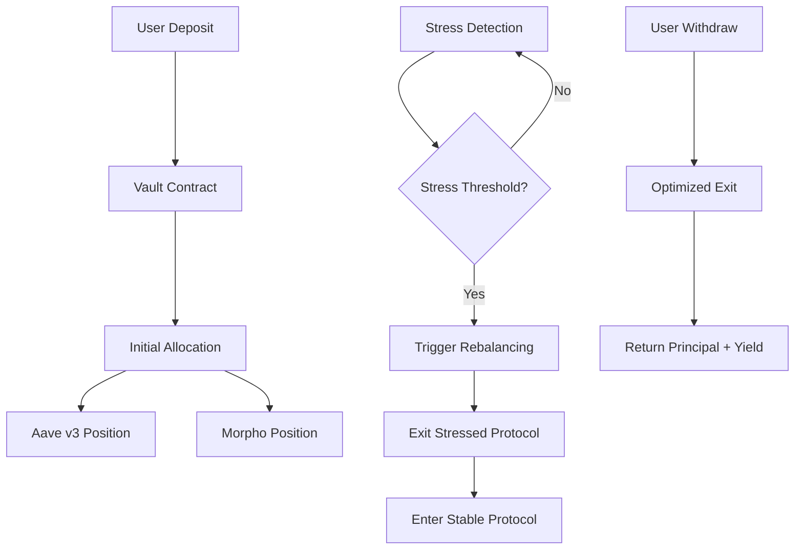

## 1. Product Overview

Predator Vault is a reactive, event-driven lending vault that hunts instability across Aave v3 and Morpho on Ethereum Sepolia. Instead of chasing yield, it detects stress signals before yields collapse and exits positions ahead of the crowd.

The vault protects and outperforms passive capital by monitoring what kills yield - utilization spikes, interest rate volatility, and liquidity stress - rather than just displayed APY. It wins every cycle by avoiding bad yield, staying liquid, and re-entering strength.

## 2. Core Features

### 2.1 User Roles

| Role | Registration Method | Core Permissions |
|------|---------------------|------------------|
| Liquidity Provider | Wallet connection | Deposit/withdraw funds, view vault performance |
| Vault Manager | Contract deployment | Configure rebalancing parameters, monitor system health |

### 2.2 Feature Module

Predator Vault consists of the following main pages:
1. **Vault Dashboard**: Real-time vault performance, current allocations, stress indicators
2. **Deposit/Withdraw Interface**: Single-click liquidity management with gas optimization
3. **Strategy Monitor**: Live stress detection across Aave v3 and Morpho markets
4. **Performance Analytics**: Historical returns, stress avoidance metrics, rebalancing history

### 2.3 Page Details

| Page Name | Module Name | Feature description |
|-----------|-------------|---------------------|
| Vault Dashboard | Performance Overview | Display current APY, total value locked, historical performance vs benchmark |
| Vault Dashboard | Allocation Status | Show current split between Aave v3 and Morpho with utilization indicators |
| Vault Dashboard | Stress Alerts | Real-time warnings when markets show instability signals |
| Deposit/Withdraw | Deposit Interface | Single-transaction deposit with automatic allocation across protocols |
| Deposit/Withdraw | Withdraw Interface | Instant withdrawal with optimal routing for minimal slippage |
| Deposit/Withdraw | Gas Optimization | Batch transactions and meta-transactions for cost efficiency |
| Strategy Monitor | Market Scanner | Live monitoring of utilization rates, borrow demand, liquidity depth |
| Strategy Monitor | Signal Dashboard | Display trigger conditions and threshold breaches |
| Strategy Monitor | Rebalancing History | Log of all automated rebalancing actions with rationale |
| Performance Analytics | Return Metrics | Show realized returns vs advertised APY comparison |
| Performance Analytics | Risk Metrics | Display volatility reduction and stress avoidance statistics |
| Performance Analytics | Benchmark Comparison | Compare performance against passive lending strategies |

## 3. Core Process

### Liquidity Provider Flow
1. User connects wallet and deposits funds into Predator Vault
2. Vault automatically allocates across Aave v3 and Morpho based on current stress assessment
3. Reactive contracts continuously monitor both protocols for instability signals
4. When stress is detected in one protocol, vault automatically rebalances to the healthier market
5. User can withdraw at any time, receiving optimized returns from active rebalancing

### Reactive Rebalancing Flow
1. Monitor detects utilization spike or interest rate volatility above threshold
2. Stress signal triggers reactive contract evaluation
3. Contract calculates optimal rebalancing strategy
4. Funds move from stressed protocol to stable protocol
5. Position continues compounding in healthier environment

## 4. User Interface Design

### 4.1 Design Style
- **Primary Color**: Deep red (#DC2626) for predator theme with black (#000000) backgrounds
- **Secondary Color**: Electric green (#10B981) for positive performance indicators
- **Button Style**: Sharp, angular design with hover animations suggesting predatory movement
- **Font**: Monospace for data displays, sans-serif for headers (Roboto/Inter)
- **Layout**: Dark theme with card-based sections, real-time updating metrics
- **Icons**: Minimalist line icons with occasional predator/animal motifs

### 4.2 Page Design Overview

| Page Name | Module Name | UI Elements |
|-----------|-------------|-------------|
| Vault Dashboard | Performance Overview | Large APY display with predator-themed animations, dark background with red accents |
| Vault Dashboard | Allocation Status | Circular progress indicators showing protocol split, color-coded stress levels |
| Vault Dashboard | Stress Alerts | Pulsing red notifications with sound effects for critical alerts |
| Deposit/Withdraw | Deposit Interface | Clean input fields with gas fee estimation, one-click max buttons |
| Deposit/Withdraw | Withdraw Interface | Similar to deposit with additional slippage warnings and routing info |
| Strategy Monitor | Market Scanner | Real-time graphs showing utilization and rate trends, auto-refresh every 5 seconds |
| Strategy Monitor | Signal Dashboard | Traffic light system (green/yellow/red) for market health status |
| Performance Analytics | Return Metrics | Line charts comparing vault performance vs passive strategies |
| Performance Analytics | Risk Metrics | Volatility comparison charts with stress event markers |

### 4.3 Responsiveness
Desktop-first design with mobile adaptation. Touch interactions optimized for mobile users with larger tap targets and swipe gestures for navigation between monitoring screens.

### 4.4 3D Scene Guidance
The vault interface features subtle 3D elements including:
- Floating particle effects representing liquidity flows
- 3D rotation for allocation pie charts
- Depth-based animations for stress level indicators
- Subtle lighting effects on hover states