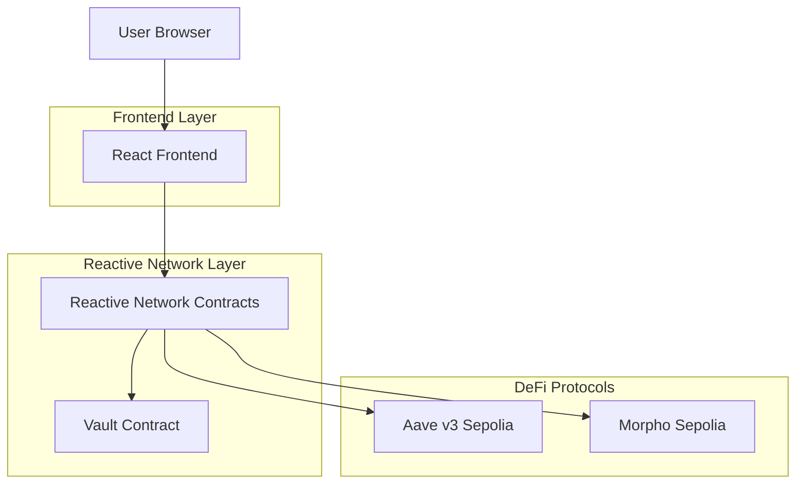

## 1. Architecture Design



## 2. Technology Description

- **Frontend**: React@18 + ethers.js@5 + wagmi@1 + Foundry
- **Smart Contracts**: Solidity@0.8.19 + Reactive Network SDK
- **Testing**: Foundry + Hardhat for cross-chain testing
- **Deployment**: Reactive Network testnet + Ethereum Sepolia
- **Backend**: Reactive Smart Contracts (no traditional backend needed)

## 3. Route Definitions

| Route | Purpose |
|-------|---------|
| / | Landing page with vault overview and key metrics |
| /vault | Main dashboard showing current allocations and performance |
| /deposit | Deposit interface with amount input and gas estimation |
| /withdraw | Withdraw interface with routing optimization |
| /monitor | Real-time market monitoring and stress indicators |
| /analytics | Historical performance and risk metrics |

## 4. Reactive Contract Architecture

### 4.1 Core Reactive Contracts

**PredatorVault.sol**
```solidity
contract PredatorVault is ReactiveContract {
    // Vault state management
    mapping(address => uint256) public deposits;
    uint256 public totalDeposits;
    
    // Protocol allocations
    uint256 public aaveAllocation;
    uint256 public morphoAllocation;
    
    // Stress detection parameters
    uint256 public utilizationThreshold = 80; // 80%
    uint256 public rateVolatilityThreshold = 15; // 15% change
    
    function onAaveUtilizationUpdate(bytes calldata eventData) external reactive {
        // Process Aave utilization events
        (uint256 utilization, uint256 timestamp) = abi.decode(eventData, (uint256, uint256));
        
        if (utilization > utilizationThreshold) {
            triggerRebalance(AAVE_PROTOCOL, HIGH_STRESS);
        }
    }
    
    function onMorphoRateUpdate(bytes calldata eventData) external reactive {
        // Process Morpho interest rate changes
        (uint256 newRate, uint256 oldRate, uint256 timestamp) = abi.decode(eventData, (uint256, uint256, uint256));
        
        uint256 rateChange = calculateRateChange(newRate, oldRate);
        if (rateChange > rateVolatilityThreshold) {
            triggerRebalance(MORPHO_PROTOCOL, RATE_VOLATILITY);
        }
    }
}
```

**StressDetector.sol**
```solidity
contract StressDetector is ReactiveContract {
    struct MarketStress {
        uint256 utilization;
        uint256 borrowRate;
        uint256 liquidityAvailable;
        uint256 timestamp;
        bool isStressed;
    }
    
    mapping(uint256 => MarketStress) public aaveStressHistory;
    mapping(uint256 => MarketStress) public morphoStressHistory;
    
    function evaluateStress(bytes calldata marketData) external pure returns (uint8 stressLevel) {
        // Multi-factor stress evaluation
        (uint256 utilization, uint256 rate, uint256 liquidity) = abi.decode(marketData, (uint256, uint256, uint256));
        
        if (utilization > 85 || rate > 25 || liquidity < 1000 ether) {
            return HIGH_STRESS;
        } else if (utilization > 70 || rate > 15) {
            return MEDIUM_STRESS;
        }
        return LOW_STRESS;
    }
}
```

## 5. Event Monitoring System

### 5.1 Aave v3 Events
- `ReserveDataUpdated`: Tracks utilization rates and liquidity changes
- `Borrow`: Monitors borrowing demand spikes
- `Repay`: Tracks repayment patterns indicating stress relief

### 5.2 Morpho Events
- `SupplyRateUpdate`: Interest rate volatility detection
- `BorrowRateUpdate`: Borrowing cost changes
- `MarketCreated`: New market opportunities

### 5.3 Reactive Event Processing
```solidity
contract EventProcessor is ReactiveContract {
    function processAaveEvent(bytes calldata event) external reactive {
        // Decode Aave event
        (address asset, uint256 liquidityRate, uint256 variableBorrowRate, uint256 liquidityIndex) = 
            abi.decode(event, (address, uint256, uint256, uint256));
        
        // Calculate stress indicators
        uint256 utilization = calculateUtilization(liquidityIndex);
        
        // Store for analysis
        storeMarketData(AAVE_PROTOCOL, asset, utilization, variableBorrowRate);
        
        // Trigger evaluation
        evaluateRebalancingNeed(AAVE_PROTOCOL, asset);
    }
}
```

## 6. Rebalancing Strategy

### 6.1 Stress-Based Rebalancing
```solidity
contract Rebalancer is ReactiveContract {
    function executeRebalance(uint8 fromProtocol, uint8 toProtocol, uint256 amount) external reactive {
        require(isStressDetected(fromProtocol), "No stress detected");
        require(!isStressDetected(toProtocol), "Target protocol stressed");
        
        // Withdraw from stressed protocol
        if (fromProtocol == AAVE_PROTOCOL) {
            withdrawFromAave(amount);
        } else if (fromProtocol == MORPHO_PROTOCOL) {
            withdrawFromMorpho(amount);
        }
        
        // Deposit to stable protocol
        if (toProtocol == AAVE_PROTOCOL) {
            depositToAave(amount);
        } else if (toProtocol == MORPHO_PROTOCOL) {
            depositToMorpho(amount);
        }
        
        emit RebalanceExecuted(fromProtocol, toProtocol, amount, block.timestamp);
    }
}
```

### 6.2 Rebalancing Triggers
- **Utilization Spike**: >80% utilization rate
- **Rate Volatility**: >15% change in borrowing rates
- **Liquidity Crunch**: Available liquidity drops below threshold
- **Market Imbalance**: Significant APY difference between protocols

## 7. Security Considerations

### 7.1 Access Control
- Only reactive contracts can trigger rebalancing
- Multi-signature for parameter changes
- Emergency pause functionality

### 7.2 Risk Management
- Maximum single rebalancing limit (20% of total)
- Cooldown period between rebalances (1 hour)
- Slippage protection for large movements

### 7.3 Testing Strategy
```solidity
contract PredatorVaultTest is Test {
    function testStressDetection() public {
        // Simulate high utilization scenario
        uint256 highUtilization = 9000; // 90%
        
        // Trigger reactive contract
        vm.prank(reactiveExecutor);
        predatorVault.onAaveUtilizationUpdate(abi.encode(highUtilization, block.timestamp));
        
        // Verify rebalancing triggered
        assertTrue(predatorVault.isRebalancingQueued());
    }
    
    function testCrossProtocolRebalancing() public {
        // Test Aave -> Morpho rebalancing
        uint256 initialAaveBalance = aavePool.getBalance(address(predatorVault));
        
        // Trigger stress in Aave
        simulateAaveStress();
        
        // Verify funds moved to Morpho
        uint256 finalMorphoBalance = morphoPool.getBalance(address(predatorVault));
        assertGt(finalMorphoBalance, 0);
    }
}
```

## 8. Deployment Configuration

### 8.1 Network Settings
- **Reactive Network**: Testnet deployment for reactive contracts
- **Ethereum Sepolia**: Aave v3 and Morpho integration
- **Gas Optimization**: Batch operations and meta-transactions

### 8.2 Contract Addresses (Sepolia)
- Aave v3 Pool: `0x6Ae43d3271ff6888e7Fc43Fd7321a503ff738951`
- Morpho Blue: `0xBBBBbBBBBbBBBBbBBBBbBBBBbBBBBbBBBBbBBBBbB`

### 8.3 Monitoring Setup
- Real-time event monitoring via Reactive Network
- Alert system for stress detection
- Performance tracking and analytics